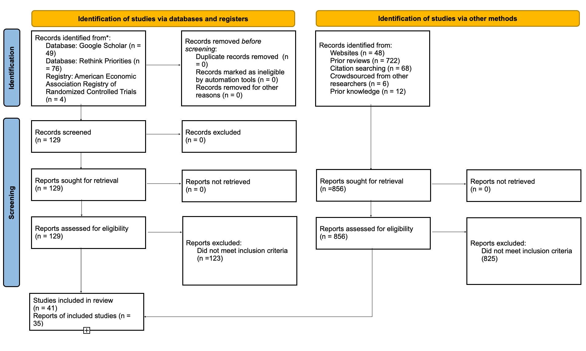

```{r setup, include=FALSE}

# so that knitr labels figures
library(knitr)
opts_chunk$set(fig.path = "./figures/",
                      echo = TRUE,
                      out.extra = "")
options(tinytex.clean = TRUE) # switch to FALSE to get the bbl file for overleaf

# libraries, functions and data
source('./scripts/libraries.R')
source('./scripts/functions.R')
source('./scripts/load-data.R')
```

```{r models_and_constants, include=F}
# Models
## Overall
model <- robumeta::robu(formula = d ~ 1, data = dat, studynum = unique_study_id, 
                       var.eff.size = var_d, modelweights = 'CORR', small = TRUE)


## Extract and format key results for each model
overall_results <- extract_model_results()
rpmc_results <- RPMC |> extract_model_results()

# constants
num_papers <- as.numeric(max(dat$unique_paper_id))
num_studies <- as.numeric(max(dat$unique_study_id))
num_interventions <- as.numeric(nrow(dat))

n_total <- noquote(format(round_to(x = sum(dat$n_c_total_pop) + sum(dat$n_t_total_pop), 
                                  accuracy = 1000, direction = "down"),
                         big.mark = ",", scientific = FALSE))

decade_tab <- dat |> group_by(unique_paper_id) |>  slice(1) |>  ungroup() |> count(decade)

RPMC_papers <- as.numeric(max(RPMC$unique_paper_id))
RPMC_studies <- as.numeric(max(RPMC$unique_study_id))
```

# Introduction {#sec1}

Global MAP consumption is increasing annually [@godfray2018] and expected to continue doing so [@whitton2021].
Abating this trend is vital to reducing chronic disease and the risk of zoonotic pandemics [@willett2019; @landry2023; @hafez2020], mitigating environmental degradation and climate change [@poore2018; @koneswaran2008; @greger2010], and improving animal welfare [@kuruc2023; @scherer2019].
However, eating MAP is widely regarded as normal, ethical, and necessary [@piazza2022; @milford2019].

There is a vast and diverse literature investigating potential means to reduce MAP consumption.
Example approaches include providing free access to meat substitutes [@katare2023], changing the price [@horgen2002] or perceptions [@kunst2016] of meat, or attempting to persuade people to change their diets [@bianchi2018conscious].
Some interventions are associated with large impacts [@lentz2020; @boronowsky2022; @reinders2017], and prior reviews have concluded that some frequently studied approaches, such as using persuasive messaging that appeals to animal welfare [@mathur2021meta], may be consistently effective.
A particularly high-profile strand of this literature employs choice architecture, i.e. altering the contexts in which MAP is selected [@bianchi2018restructuring], for instance by changing menu layouts [@bacon2018; @gravert2021], placing vegetarian items more prominently in dining halls [@ginn2024], or making plant-based options the default at catered meals [@hansen2021].
Choice architecture has been cited as a cheap, effective way of altering dietary behavior [@colgan2024], and governments, universities, and other institutions are increasingly implementing these approaches in such settings as dining halls [@pollicino2024] and hospital cafeterias [@morgenstern2024].

However, recurring design and measurement limitations comprise this literature.
Many interventions are either not randomized [@garnett2020] or underpowered [@delichatsios2001].
Measured outcomes are often imperfect proxies of MAP consumption, such as attitudes, intentions, and hypothetical choices [@raghoebar2020; @vermeer2010], yet behaviors often do not track with these psychological processes [@mathur2021effectiveness; @porat2024] and reported preferences [@hensher2010].
Further, many studies measure only immediate rather than long-term effects [@hansen2021; @griesoph2021].

In the past few years, a new wave of MAP reduction research has made commendable methodological advances in design, measurement validity, and statistical power.
Historically, in some scientific fields, strong effects detected in early studies with methodological limitations were ultimately overturned by more rigorous follow-ups [@wykes2008; @paluck2019; @scheel2021].
Does this phenomenon hold in the MAP reduction literature as well?

To address this question, we conducted a meta-analysis of RCTs that aim to reduce MAP consumption and that meet basic methodological standards [@andersson2021; @kanchanachitra2020; @abrahamse2007; @acharya2004; @banerjee2019; @bianchi2022; @bochmann2017; @bschaden2020; @carfora2023; @cooney2014; @cooney2016; @feltz2022; @haile2021; @hatami2018; @hennessy2016; @jalil2023; @mathur2021effectiveness; @merrill2009; @norris2014; @peacock2017; @polanco2022; @sparkman2021; @weingarten2022; @piester2020; @aberman2018; @aldoh2023; @allen2002; @camp2019; @coker2022; @sparkman2020; @berndsen2005; @bertolaso2015; @fehrenbach2015; @mattson2020; @shreedhar2021].
Specifically, we restricted eligibility to RCTs that measured consumption outcomes at least a single day after treatment was first administered and that had at least 25 subjects in both treatment and control (or, for cluster-assigned studies, at least ten clusters in total).

Numerous studies specifically aim to reduce consumption of red and processed meat (RPM), rather than all MAP.
Such interventions may induce people to switch from consuming RPM to consuming other forms of MAP, such as chicken or fish [@grummon2023].
While RPM is particularly detrimental for human health and greenhouse gas emissions [@abete2014; @lescinsky2022], producing other forms of MAP also has severe externalities, such as risking zoonotic outbreaks from factory farms [@hafez2020] and causing land and water pollution [@grvzinic2023].
Additionally, raising chicken and fish may lead to substantially worse outcomes for animal welfare [@mathur2022ethical].
For these reasons, we specifically assessed the relative effectiveness of interventions that aimed to reduce all MAP consumption, versus those that aimed only to reduce RPM consumption (`r RPMC_studies` studies) [@anderson2017; @carfora2017correlational; @carfora2017randomised; @carfora2019; @carfora2019informational; @delichatsios2001talking; @dijkstra2022; @emmons2005cancer; @emmons2005project; @jaacks2014; @james2015; @lee2018; @lindstrom2015; @perino2022; @schatzkin2000; @sorensen2005; @wolstenholme2020].

Studies in our meta-analysis pursued one of four theoretical approaches: choice architecture, psychological appeals (typically manipulations of perceived norms around eating meat), explicit persuasion (centered around animal welfare, the environment, and/or health), or a combination of psychological and persuasion messages.
Interventions varied in delivery method, for example, documentary films [@mathur2021effectiveness], leaflets [@peacock2017], university lectures [@jalil2023], op-eds [@haile2021], and changes to menus in cafeterias [@andersson2021] and restaurants [@coker2022; @sparkman2021].
We estimated overall effect sizes as well as effect sizes associated with different theoretical approaches and delivery mechanisms.
Although we find some heterogeneity across theories and mechanisms, we find consistently smaller effects on MAP consumption than previous reviews have suggested [@bianchi2018restructuring; @byerly2018; @chang2023; @harguess2020; @kwasny2022; @mathur2021meta; @meier2022], with some intriguing exceptions.
Thus, contradicting previous reviews that placed fewer (if any) restrictions on studies' methodological rigor (Supplement), we conclude that meaningfully reducing MAP consumption is an unsolved problem.
However, many promising approaches still await rigorous evaluation.

# Results {#sec2}

## Descriptive overview {#sec2.1}

Our meta-analysis included `r num_papers` papers comprising `r num_studies` studies and `r num_interventions` separate point estimates.
Each point estimate corresponded to a distinct intervention.
The total sample size `r n_total` subjects (caveat that this is a broad approximation: many interventions were administered at the level of day or cafeteria and did not record an N for subjects).

```{r mean_subjects, include=F}
total_pops <- dat |> filter(cluster_assigned == 'N') |> mutate(total_pop = as.numeric(n_c_post + n_t_post)) |> pull(total_pop)

median_total_pop <- round(median(total_pops, na.rm = TRUE))
percentile_25 <- round(quantile(total_pops, 0.25, na.rm = TRUE))
percentile_75 <- round(quantile(total_pops, 0.75, na.rm = TRUE))
# nums per approach
choice_Ns <- dat |> filter(theory == 'Choice Architecture') |> extract_model_results() |> select(N_estimates, N_studies)
```

Because methodological quality is rapidly improving in the literature on MAP reduction, the majority of eligible papers (`r  decade_tab |> filter(decade == "2020s") |> pull(n)` of `r num_papers`) were published from 2020 onwards, although the earliest was published in 2002 [@allen2002].
Among studies where treatment was assigned to individuals rather than to clusters (e.g., every student in a class), the median analyzed sample size per study was `r median_total_pop` subjects(25\$\^{\\text{th}}\$--75$^{\text{th}}$ percentiles: `r paste0(percentile_25, ", ", percentile_75)`).

## Constituent Theories {#sec2.2}

```{r nums_per_approach, include=F}
# nums per approach
choice_Ns <- dat |> filter(theory == 'Choice Architecture') |> extract_model_results() |> select(N_estimates, N_studies)

persuasion_Ns <- dat |> filter(theory == 'Persuasion') |> extract_model_results() |> select(N_estimates, N_studies)

psych_Ns <- dat |> filter(theory == 'Psychology') |> extract_model_results() |> select(N_estimates, N_studies)

psych_persuasion_Ns <- dat |> filter(theory == 'Persuasion & Psychology') |> extract_model_results() |> select(N_estimates, N_studies)
```

We found that studies' theoretical approaches could be grouped into four categories.
**Choice architecture** studies [@andersson2021; @kanchanachitra2020] `r paste0("(n = ", choice_Ns$N_studies, " studies with ", choice_Ns$N_estimates, " estimates)")` manipulate aspects of physical environments to reduce MAP consumption, such as by placing the vegetarian option at eye level on a cafeteria's billboard menu [@andersson2021]. **Persuasion** studies [@kanchanachitra2020; @aberman2018; @abrahamse2007; @acharya2004; @banerjee2019; @bianchi2022; @bochmann2017; @bschaden2020; @carfora2023; @hennessy2016; @piester2020; @cooney2014; @cooney2016; @feltz2022; @haile2021; @hatami2018; @jalil2023; @mathur2021effectiveness; @merrill2009; @norris2014; @peacock2017; @polanco2022; @sparkman2021; @weingarten2022] `r paste0("(n = ", persuasion_Ns$N_studies, " studies with ", persuasion_Ns$N_estimates, " estimates)")` focus on health, environmental (usually climate change), and animal welfare reasons to reduce MAP consumption. Such messages are often delivered through printed materials, such as leaflets [@haile2021; @polanco2022], booklets [@bianchi2022] articles and op-eds [@sparkman2021; @feltz2022], and videos [@sparkman2021; @cooney2016; @mathur2021effectiveness]. Less common delivery methods included in-person dietary consultations [@merrill2009], emails [@banerjee2019], and text messages [@carfora2023]. **Psychology** studies [@aldoh2023; @allen2002; @camp2019; @coker2022; @piester2020; @sparkman2020] `r paste0("(n = ", psych_Ns$N_studies, " studies with ", psych_Ns$N_estimates, " estimates)")` manipulate the interpersonal, cognitive, or affective factors associated with eating MAP. The most common psychological intervention is centered on social norms seeking to alter the perceived popularity of non-MAP dishes [@sparkman2020]. In one study, a restaurant put up signs stating that "[m]ore and more [retail store name] customers are choosing our veggie options" [@coker2022]. In another, a university cafeteria put up signs stating that "[i]n a taste test we did at the [name of cafe], 95% of people said that the veggie burger tasted good or very good!” [@piester2020]. 
One study told participants that people who ate meat are more likely to endorse social hierarchy and embrace human dominance over nature [@allen2002].
Other psychological interventions include response inhibition training, where subjects are trained to avoid responding impulsively to stimuli such as unhealthy food [@camp2019], and implementation intentions, where participants list potential challenges and solutions to changing their own behavior [@aberman2018; @shreedhar2021].
Finally, some interventions combines **persuasion** approaches with **psychological** appeals to reduce MAP consumption [@aberman2018; @berndsen2005; @bertolaso2015; @carfora2023; @fehrenbach2015; @hennessy2016; @mathur2021effectiveness; @mattson2020; @piester2020; @shreedhar2021] `r paste0("(n = ", psych_persuasion_Ns$N_studies, " studies with ", psych_persuasion_Ns$N_estimates, " estimates)")`.
These studies typically combine a persuasive message with a norms-based appeal [@piester2020; @mattson2020] or an opportunity to pledge to reduce one's MAP consumption [@mathur2021effectiveness; @shreedhar2021].

## Meta-analytic results {#sec2.3}

```{r needed_vars, include=F}
low_prop_test <- prop_stronger( q = 0.1, M = overall_results$Delta,
                                t2 = overall_results$tau^2,
                                se.M = overall_results$SE, tail = "above",
                                estimate.method = "calibrated",
                                ci.method = "calibrated", dat = dat,
                                yi.name = "d", vi.name = "var_d",
                              bootstrap = "ifneeded", R = 200) |> 
   mutate(across(1:6, \(x) round(x, 3)))
low_prop_test
high_prop_test <- prop_stronger( q = 0.2,  M = overall_results$Delta,
                                t2 = overall_results$tau^2,
                                se.M = overall_results$SE, tail = "above",
                                estimate.method = "calibrated",
                                ci.method = "calibrated", dat = dat,
                                yi.name = "d", vi.name = "var_d",
                              bootstrap = "ifneeded", R = 200) |> 
     mutate(across(1:6, \(x) round(x, 3)))
high_prop_test
```

In our dataset, the pooled effect of all interventions is standardized mean difference (SMD) = `r overall_results$Delta` (95% CI: `r overall_results$CI`), p = `r overall_results$p_val`, with some heterogeneity (standard deviation of population effects $\tau$ = 0.082).
Given the pooled effect size and the estimated heterogeneity, we estimate that `r round(low_prop_test$est * 100, 2)`% of true effects are above SMD = 0.1, and just `r round(high_prop_test$est * 100,2)`% are above SMD = 0.2.

Table 1 compares the overall meta-analytic estimate to the subgroup estimates associated with the four major theoretical approaches, as well as the three categories of persuasion (animal welfare, environment, and health).

\begin{center}
[Table 2 about here]
\end{center}
\begin{center}
[Figure 1 about here]
\end{center}

```{r rpmc_prop, include=F}

red_high_prop_test <- prop_stronger( q = 0.2, M = rpmc_results$Delta,
                                     t2 = rpmc_results$tau^2,
                                se.M = rpmc_results$SE, tail = "above",
                                estimate.method = "calibrated",
                                ci.method = "calibrated", dat = RPMC,
                                yi.name = "d", vi.name = "var_d",
                              bootstrap = "ifneeded", R = 200) |> 
     mutate(across(1:6, \(x) round(x, 3)))
```

By contrast, the `r RPMC_studies` studies that only attempted to reduce consumption of RPM, comprising 25 point estimates, yielded a pooled effect of SMD = `r rpmc_results$Delta` (95% CI: `r rpmc_results$CI`), p = `r rpmc_results$p_val`, $\tau$ = `r rpmc_results$tau`.
Among these studies, we estimate that `r round(red_high_prop_test$est * 100, 2)`% of true RPM effects are above SMD = 0.2.

## Meta-regression on study characteristics analysis {#sec2.4}

Table 2 displays average differences in effect size by study population, region, era of publication, and delivery method.

\begin{center}
[Table 2 about here]
\end{center}

## Sensitivity Analyses {#sec2.5}

Table 3 presents average differences by publication status, data collection strategy, and open science practices.

\begin{center}
[Table 3 about here]
\end{center}

```{r publication_bias, include=F, message=F}
rma_model <- metafor::rma.uni(yi = d, vi = var_d, data = dat)
hedges_model <- selmodel(x = rma_model, type = 'stepfun', 
                         alternative = 'greater', steps = c(0.025, 1))

pub_bias_corrected_estimate <- PublicationBias::pubbias_meta(yi = dat$d, vi = dat$var_d, cluster = dat$unique_study_id, model_type = 'robust', favor_positive = TRUE, alpha_select = .05, small = TRUE, selection_ratio = 1) 

pub_bias_estimate <- round(pub_bias_corrected_estimate$stats$estimate, 3)
pub_ci_lower <- round(pub_bias_corrected_estimate$stats$ci_lower, 2)
pub_ci_upper <- round(pub_bias_corrected_estimate$stats$ci_upper, 2)
pub_ci_p_val <- round(pub_bias_corrected_estimate$stats$p_value, 3)

nulls <- dat |> filter(neg_null_pos == 0| neg_null_pos == -1)
worst_case <- extract_model_results(data = nulls)
```

The meta-analytic mean corrected for publication bias [@hedges1992] was `r round(hedges_model$b, 3)` (95% CI: [`r paste0(round(hedges_model$ci.lb, 3), ",", " ", round(hedges_model$ci.ub, 3))`]), p = `r round(hedges_model$pval, 3)`.
A conservative estimate that accounts for the possibility of worst-case publication bias [@mathur2024] yields an estimate of SMD = `r worst_case$Delta` (95% CI: `r worst_case$CI`), p = `r worst_case$p_val`.

Figure 2 is a significance funnel plot [@mathur2020] that relates studies’ point estimates to their standard errors and compares the pooled estimate within all studies (black diamond) to the worst-case estimate (gray diamond).

\begin{center}
[Fig 2 about here]
\end{center}

# Methods {#sec3}

```{r methods_nums, include=F}
reviews_count <- nrow(read.csv('./data/review-of-reviews.csv'))
excluded_count <- nrow(read.csv('./data/excluded-studies.csv'))
```

## Study selection {#sec3.1}

\begin{comment} is this first sentence repetitive of the intro or should we have everything in the methods section that's methods-y
\end{comment}

Our meta-analytic sample comprises randomized controlled trial evaluations of interventions intended to reduce MAP consumption that had at least 25 subjects in treatment and control (or at least 10 clusters for studies that were cluster-assigned) and that measured MAP consumption at least a single day after treatment begins.
We required that studies have a pure control group receiving no treatment.
We further restricted our search to studies that were publicly circulated in English by December 2023.

We also made three decisions regarding study inclusion after data collection began.
First, we counted and analyzed reductions in RPM separately.
Second, we excluded studies that sought to induce substitution from one kind of MAP to another, e.g. swapping red meat with fish Third, we excluded studies with involuntary reductions, i.e. interventions in institutions where subjects were simply served more vegetables on their plate.

Given our interdisciplinary research question and previous work indicating a large grey literature [@mathur2021meta], we designed and carried out a customized search process.
We 1) reviewed `r reviews_count` prior reviews, nine of which yielded included articles [@mathur2021meta; @bianchi2018conscious; @bianchi2018restructuring; @ammann2023; @chang2023; @DiGennaro2024; @harguess2020; @ronto2022; @wynes2018]; 2) conducted backwards and forward citation search; 3) reviewed published articles by authors with papers in the meta-analysis; 4) crowdsourced potentially missing papers from leading researchers in the field 5) searched Google Scholar for terms that had come up in studies repeatedly; 6) used an AI search tool to search for gray literature (\url{https://undermind.ai/}); and 7) checked two databases emerging from ongoing nonprofit projects that both seek to identify all papers on meat-reducing interventions.

All three authors contributed to the search.
Inclusion/exclusion decisions were primarily made by the first author, with all authors contributing to discussions about borderline cases.

Figure 3 is a PRISMA diagram depicting the sources of included and excluded studies.

\begin{center}
[Fig 3 about here]
\end{center}

See supplement for further discussion.

## Data extraction {#sec3.3}

The first author extracted all data.
We extracted an effect size for one outcome per intervention: the latest possible measure of net MAP or RPM consumption.
Sample sizes corresponded to the same time point.
Additional variables coded included information about publication, details of the interventions, length of delay, intervention theories, and additional details about interventions' methods, contexts, and open science practices (see accompanying code and data repository for full documentation).

When in doubt about calculating effect sizes, we consulted available datasets and/or contacted authors.

To assess risk of bias, we collected data on whether outcomes were self-reported or objectively measured, publication status, and presence of a pre-analysis plan and/or open data (see table 3).

All effect size conversions were conducted by the first author using methods and R code initially developed for previous papers [@paluck2019; @paluck2021; @porat2024] using standard techniques from [@cooper2019], with the exception of a difference in proportion estimator that treats discrete events as draws from a Bernoulli distribution (see appendix to [@paluck2021] for details).
We used Glass's $\Delta$ whenever possible as our measure of standardized mean difference: $\Delta = \frac{\mu_T - \mu_C}{\sigma_C}$.
We standardized on the SD of the control group at pre-treatment.
If group SDs were not available, we standardized on the pooled SD.
When means and SDs were not available, we converted effect sizes from: regression coefficients, eta squared, or z scores.
When there was insufficient information to calculate a specific SMD, but the text reports the result as a null, we recorded the outcome as an "unspecified null" and set it to 0.01.

## Statistical analysis methods {#sec3.4}

Results were synthesized using robust variance estimation (RVE) methods [@hedges2010] as implemented by the `robumeta` package [@fisher2015] in `R`[@Rlang].
Many studies in our sample featured multiple treatment groups compared to a single control group.
Therefore, we used the RVE method to allow for the resulting dependence between observations, as well as a standard small-sample correction.

Data analyses were largely conducted with custom functions building on `tidyverse` [@wickham2019] We assessed publication bias using selection model methods [@hedges1992; @vevea1995], sensitivity analysis methods [@mathur2024], and the significance funnel plot [@mathur2020].
These methods assume that the publication process favors “statistically significant” (i.e., p \< 0.05) and positive results over “nonsignificant” or negative results.
Our sensitivity check meta-analyzes only non-affirmative results, which creates an estimate under a hypothetical “worst-case” publication bias scenario where affirmative studies are almost infinitely more likely to be published than non-affirmative studies.
We conducted these analyses using functions in `metafor` [@viechtbauer2010] and `PublicationBias` [@mathur2020; @mathur2024].

We used `Rmarkdown` [@xie2018] and a containerized online platform [@moreau2023; @clyburne2019] to ensure computational reproducibility [@polanin2020].

# Discussion

Our overall effect of SMD = `r overall_results$Delta`, as well as our upper confidence bound of SMD = `r round(model$reg_table$CI.U, 2)`, lead us to conclude that reducing MAP consumption is an unsolved problem.
Effects were also consistently small across an array of locations, study designs, and intervention categories.
Some individual studies found comparatively larger effects (SMD \> 0.5: [@carfora2023; @merrill2009; @kanchanachitra2020; @bianchi2022; @piester2020]).
However, each builds on a fairly unique theory of change and employs idiosyncratic methods.
We view these these interventions as intriguing candidates for subsequent research and replication, and conclude that no theoretical approach, delivery mechanism, or intended persuasive message should be considered a well-validated method of reducing MAP consumption.

Though this may surprise readers of previous reviews [@mathur2021meta; @meier2022; @mertens2022], our divergent results likely reflect our stricter methodological inclusion criteria.
For instance, of the ten largest effect sizes recorded in [@mathur2021effectiveness], nine measured attitudes and/or intentions, and the tenth came from a non-randomized design.
Prior research has found that intentions often do not predict behavior [@mathur2021effectiveness], and reviews in other fields have found systematic differences in impacts between randomized and non-randomized evaluations [@porat2024; @stevenson2023].
Our results raise the possibility that previous reviews’ positive findings might be largely attributable to bias, though this will require further empirical evaluation.

Another potentially surprising result is that very few (two) choice architecture papers met our methodological inclusion criteria.
Most potentially eligible papers either measured hypothetical outcomes or measured outcomes immediately after the intervention.
Moreover, prior reviews that found choice architecture approaches to be consistently effective at modifying diet typically focused on foods that may have weaker cultural and social attachments than MAP, such as sugary drinks and snacks [@venema2020; @adriaanse2009].
We speculate that people are more likely to notice, and care, when the burger is missing from the menu than when their soft drink is smaller.

Likewise, as our analyses show, studies aimed at reducing RPM consumption are associated with a much larger effect size (SMD = `r rpmc_results$Delta`) than those aimed at reducing all MAP consumption.
Sharply curtailing RPM consumption is a core component of current leading dietary guidelines, such as the heart-healthy diet [@diab2023], but many of these same guidelines encourage moderate intake of poultry and fish.
Further, reducing RPM consumption is frequently mentioned as something consumers can and should do to personally fight climate change [@auclair2024].
By contrast, vegetarianism is still a minority diet worldwide [@tilman2014] that consumers consider to be difficult, unsatisfying, and expensive [@bryant2019].
We speculate that cutting back on RPM is perceived as easier and more likely to be socially rewarded than is cutting back on MAP generally, and that this explains the observed difference in effect sizes.

We caution that our analyses are limited by our small sample size.
Our moderation analysis, for instance, tests differences between studies that are highly confounded, limiting our ability to detect the independent association of a given variable with effect size.
Further, our meta-analytic database is a non-random sample of the literature writ large, and our estimates of publication bias should not be taken as estimates for the entire literature.

Most importantly, our results are highly sensitive to inclusion choices about dependent variables, which arguably means they lack robustness.
However, this critique is a double-edged sword.
Our paper suggests that prior reviews' findings are also more sensitive to inclusion rules than was previously known.

Overall, we are encouraged by positive trends in the literature.
First, as noted, a majority of studies in our meta-analysis have been published since 2020, indicating the field's growing dedication to questions of credible design and measurement.
Second, we observe many fruitful collaborations between researchers and advocacy organizations, as shown by the plethora of nonprofit white papers in our sample.
Third, many promising designs and interventions yet await rigorous evaluation.
For instance, no study that met our criteria evaluated extended contact with farm animals [@cerrato2022], manipulations to the price of meat [@wilde2016], activating moral and/or physical disgust [@palomo2018], watching popular media such as the Simpsons episode *Lisa the Vegetarian* [@byrd2010] or the movie *Babe [@novatna2019]*, and many categories of choice architecture intervention [@olafsson2024].
Moreover, we are encouraged by contemporary research designs that offer creative solutions to longstanding measurement challenges, for example by implementing a default intervention at lunch and then measuring outcomes at dinner as well to assess potential compensatory effects [@vocski2024].

In sum, though we view meaningfully reducing MAP consumption as an unsolved problem, we see no reason to think it is unsolvable.

\bmhead{Acknowledgments}

*Thanks to Alex Berke, Alix Winter, Anson Berns, Dan Waldinger, Hari Dandapani, Adin Richards, Martin Gould, and Matt Lerner for comments on an early draft. Thanks to Jacob Peacock, Andrew Jalil, Gregg Sparkman, Joshua Tasoff, Lucius Caviola, Natalia Lawrence, and Emma Garnett for help with assembling the database and providing guidance on their studies. Thanks to Sofia Vera Verduzco for research assistance. We gratefully acknowledge funding from the NIH (grant XXX), Open Philanthropy (YYY), and the Food Systems Research Fund (Grant FSR 2023-11-07).*

# Declarations {.unnumbered}

\newpage

## Tables

```{r meta_table, echo=FALSE, message=FALSE, results='asis'}
source('./scripts/table-one-meta.R')
meta_table
```

```{r moderator_table, echo=F, message=F}
source('./scripts/table-two-moderator.R')
moderator_table
```

```{r sensitivity_table,echo=F, message=F}
source('./scripts/table-three-sensitivity.R')
sensitivity_table
```

\clearpage

## Figures

```{r forest_plot, fig.cap="Forest plot for MAP reduction studies. Each point corresponds to a fixed effects meta-analysis for each paper. Papers employing multiple theoretical approaches are represented once per theory. Dot size is inversely proportional to variance. Points are sorted within theory by SMD. A random effects meta-analysis for the entire dataset is plotted at the bottom. The black line demarcates an effect size of zero, and the dotted line is the observed overall effect.", echo=FALSE, message=F, fig.align='center', fig.pos='H', fig.height=9, fig.width=6}
source('./scripts/forest-plot.R')
forest_plot 
```

```{r funnel_plot, echo=FALSE, message=F, fig.cap="Significance funnel plot.", fig.align='center', fig.pos='H', fig.height=9, fig.width=6}
funnel_plot <- significance_funnel(yi = dat$d, vi = dat$var_d, favor_positive = TRUE, , alpha_select = 0.05, plot_pooled = TRUE)
funnel_plot
```

```{r prisma_diagram, echo=FALSE, message=FALSE, fig.align='center', fig.pos='H', fig.height=8, fig.width=6, out.width='120%'}


```

\newpage

# Supplement {#Sec5}

## Description of code and data repository

Our code and data are shared on the Open Science Framework [LINK], GitHub [LINK, and Code Ocean [LINK].
Our main document, `MAP-reduction-meta.Rmd`, reproduces this paper, with every quantitative claim (as well as the first two figures) reproduced each time the document is knit.

Our included datasets are

-   `vegan-meta.csv`, our primary meta-analytic dataset;

-   `rpmc-data.csv`, our secondary dataset of studies aimed at reducing consumption of RPM;

-   `robustness-data.csv`, another secondary dataset borderline studies for a robustness check (see section below);

-   `review-of-reviews.csv`, which details the the `r reviews_count` reviews we consulted;

-   `excluded-studies.csv`, which details the papers we screened but did not include, along with their reasons for exclusion and where we found them (the studies in `robustness-data.csv` are included in this dataset as well).

The repositories have more details about the included scripts and supplementary materials (e.g. licenses).

## Robustness to less stringent inclusion criteria {#Sec5.1.1}

```{r robustness_check, include=F}
source('./scripts/robustness-checks.R')

robust_only_results <- robust_dat |> extract_model_results()

# overall result with robust_dat merged
merged_dat <- full_join(dat, robust_dat) |> 
  select(c(-unique_study_id, unique_paper_id)) |>
  group_by(title) |>
  mutate(unique_paper_id = cur_group_id())  |>
  ungroup() |>
  group_by(unique_paper_id, study_num_within_paper) |>
  mutate(unique_study_id = cur_group_id()) |>
  ungroup() |>
  select(author, year, title, unique_paper_id, unique_study_id, everything())

merged_results <- merged_dat |> extract_model_results()

## look at biggest results
merged_dat |> arrange(desc(d)) |> select(author,year,  ,se_d, inclusion_exclusion) |> head(10)
```

We coded and meta-analyzed a supplementary dataset of `r robust_only_results$N_studies` studies, comprising `r robust_only_results$N_estimates` point estimates, that feature many strong design features but that were excluded for one of five reasons: 1) issues with random assignment or the control group (for instance, where the control group receives some aspect of treatment [@piazza2022], or where treatment was alternated weekly but not randomly [@garnett2020]); 2) underpowered (too few clusters [@reinders2017] or subjects [@lentz2019]); 3) immediate outcome measurement [@dannenberg2023; @sparkman2017; @griesoph2021; @hansen2021]; 4) actively encouraging substitution within categories of MAP, e.g. from red meat to fish [@celis2017; @johansen2009]; or 5) uncertainty in calculating an effect size arising from missing information about the behavior of diners who opt out of treatment to avoid a vegetarian meal [@betterfoodfoundation2023].

Taken together, our integrated dataset including both our main sample and this supplementary one yields a pooled effect of SMD = `r merged_results$Delta` (95% CI: `r merged_results$CI`), p = `r merged_results$p_val`.
Particularly large results were found in studies that measured outcomes immediately [@hansen2021] or that had smaller samples [@lentz2020].

## Robustness to an alternative estimation method {#Sec5.1.2}

Our pre-analysis plan (\url{https://osf.io/3sth2}) used a model from `metafor` to analyze a synthetic dataset.
However, as we assembled the actual dataset, we noticed that many papers had, across interventions, non-independent observations, typically in the form of multiple treatments compared to a single control group.
Upon discussion, the team's statistician (MBM) suggested that the `CORR` model from the `robumeta` package, a robust variance estimation (RVE) method, would be a better fit.

```{r alt_models, include=F}
alt_model <- robust(metafor::rma.uni(yi = d, vi = var_d, data = dat), 
                    cluster = dat$unique_study_id)

hier_model <- robumeta::robu(formula =d ~ 1, data = dat,
                             studynum = author,
                             var.eff.size = var_d, modelweights = 'HIER', 
                             small = TRUE) 
```

Using our original estimation strategy from `metafor`, we detect a pooled effect size of `r round(alt_model$beta, 2)` (95% CI: [`r paste0(round(alt_model$ci.lb, 2), ", ", round(alt_model$ci.ub, 2))`]), p = `r alt_model$pval`.
(Although `metafor` also provides an RVE estimator, it applies the correction to the standard errors and not to the overall estimate, and we preferred a model that incorporates clustering information at the level of effect estimation.)

## Robustness to a stricter definition of delay {#Sec5.1.3}

```{r strict_delay_model}
strict_delay_model <- dat |> filter(delay_post_endline > 0) |> extract_model_results()
```

Our delay-related inclusion criterion aimed to limit our analysis to enduring effects.
We were concerned that subjects who are encouraged to have a single vegetarian meal might later compensate by consuming more MAP at the next one, which would make an immediate outcome measurement an upwardly biased estimate of overall effects.

Upon reviewing studies, however, we found that numerous high-quality studies modified eating environments over multiple days and did not incorporate a delayed measure following the *final* day of treatment.
For example, [@andersson2021] included 50 combined days of treatment and control, but the interval between treatment and any individual outcome measurement was zero days.
By one light, such studies lack delayed outcome measures.
In another, the multi-day setup in a single environment allows for theoretical delay so long as participants can return to the site of treatment and have their meal choices evaluated multiple times.

We decided to include multi-day studies where delayed outcomes were at least possible through repeat visits by subjects to the intervention site.
Our delay variable therefore reflects the days elapsed from the beginning of treatment, rather than its conclusion, to measurement.

We also coded a secondary delay variable that corresponds to time elapsed between treatment *conclusion* to measurement.
Restricting our analysis to the `r strict_delay_model$N_studies` studies and `r strict_delay_model$N_estimates` point estimates where this secondary delay exceeds zero, we observe an effect of SMD = `r strict_delay_model$Delta` (95% CI: `r strict_delay_model$CI`), p = `r strict_delay_model$p_val`.

## Notes on search strategy {#Sec5.2}

```{r prisma_numbers, include=F, echo=F}
source('./scripts/prisma-script.R')
```

\begin{comment} we could take the next few paragraphs out and start with the sentence "we employed what could be called a "prior-reviews-first" search strategy."
\end{comment}

Our search process was shaped by three unusual features of our research project.
First, our surveyed literature was highly interdisciplinary, with few shared terms to describe itself.
For instance, the term 'MAP' is not universally agreed upon; other papers use animal-based protein, edible animal products, or just meat, while others focus on a particular, sometimes unusual category of MAP, such as fish sauce [@kanchanachitra2020], or discussed their agenda mainly in terms of increasing plant-based alternatives.
Coming up with an exhaustive list of terms to search for from first principles would have been, in our opinion, virtually impossible.

Second, our methods-based inclusion criteria complicated screening on titles and abstracts.
While it was sometimes possible to use solely that information to eliminate studies with no interventions (e.g. survey-based research), determining whether an intervention qualified almost always required some amount of full text screening.
We also discovered that terms like "field experiment" have varying meanings across papers, and identifying whether a measured food choice was hypothetical or not often required a close reading.
For these reasons, screening thousands or tens of thousands of papers struck us as prohibitively time-consuming.

Third, we found an extraordinary number of prior reviews, typically aimed at one disciplinary strand or conceptual approach, touching on our research question.
Reviewing tables and bibliographies of those papers proved enormously fruitful for both assembling our dataset and getting a sense of the broader literature.

For these reasons, we employed what could be called a "prior-reviews-first" search strategy.
Of the `r nrow(all_papers)` papers we reviewed, a full `r round(prior_review_n / nrow(all_papers), 2) * 100` % of all manuscripts we screened came from prior reviews, and `r round(included_review_count/num_papers, 2) * 100` % of papers in our main dataset.
(See the next section of the supplement for notes on reviews that were especially informative.) Then, as detailed in the main text, we employed a multitude of other search strategies to fill in our dataset, one of which was systematic search.
In particular, we searched Google Scholar for the following list of terms, and checked ten pages of results for each:

-   "dynamic" "norms" "meat"
-   "dynamic" "norms" "meat" "consumption"
-   "field" "experiment" "plant-based"
-   "meat" "alternatives" "default" "nudge"
-   "meat" "consumption" "reducing" "random"
-   "meat" "purchases" "information" "nudge"
-   "meat" "reduction" "randomized"
-   "meat" "sustainable" "random"
-   "nudge" "meat" "default"
-   "nudge" "reduce" "meat" "consumption"
-   "nudge" "sustainable" "consumption" "meat"
-   "nudge" "theory" "meat" "purchasing"
-   "norms" "animal" "products"
-   "nudges" "norms" "meat"
-   "random" "nudge" "meat"
-   "randomized controlled trial" "meat" "consumption" "reduce"
-   "sustainable" "meat" "nudge"
-   "sustainable" "meat" "nudge" "random"
-   "university" "meat" "default" "reduction"

Additionally, we searched the American Economic Association's RCT registry for the the terms "meat" and "random" and reviewed all matching results in the relevant time frame.

Another unconventional part of our search strategy was our use of of an AI-based search tool (\url{https://undermind.ai/}), to which we described our research question and then reviewed 100 results that it generated.
This yielded one paper that met our inclusion criteria [@mattson2020] that seems to have slipped past many other systematic search processes.

Finally, we benefited from two in-progress literature reviews at Rethink Priorities, "a think-and-do tank" that researches animal welfare as one of its four main priorities.
Both of these literature reviews are aimed at assessing interventions that reduce MAP consumption, but have broader inclusion criteria than our paper employed.
For more details on these two projects, see \url{<https://osf.io/74paj>} and \url{<https://meat-lime.vercel.app>}.

## Discussion of prior reviews

We turn now to a selective overview of prior reviews that were highly relevant to this one.

Among the reviews that found MAP reduction interventions to be effective, several focused exclusively on choice architecture.
[@arno2016] found that nudges led to an average increase of healthy dietary choices of 15.3%, while [@byerly2018] found that committing to reduce meat intake and making menus vegetarian by default were more effective than educational interventions.
However, the vast majority of vegetarian-default studies we analyzed for this paper did not qualify for our analysis because they lacked delayed outcomes.
In a similar vein, [@mertens2022] concludes that food choices are "particularly responsive to choice architecture interventions" (p. 1), but featured no studies that met our inclusion criteria.

[@bianchi2018restructuring] found that reducing meat portions, making alternatives available, moving meat products to be less conspicuous, and changing meat's sensory properties can all reduce meat demand.
[@pandey2023] found that changing the presentation and availability of sustainable products was effective in increasing demand for them.

In a meta-review, [@grundy2022] found environmental education to be especially promising, with substantial evidence also supporting health information, emphasizing social norms, and decreasing meat portions.

Some reviews have focused on particular settings for MAP reduction interventions.
[@hartmannboyce2018] found that grocery store interventions, such as price changes, suggested swaps, and changes to item availability, were effective at changing purchasing choices.
However, that review covered a wide variety of health interventions, such as reducing consumption of dietary fat and increasing fruit and vegetable purchases.
It is unclear how directly such findings translate to MAP reduction efforts.
Meanwhile, [@chang2023] focused on university meat-reduction interventions and found more promising results than did reviews that looked at the wider public.
[@harguess2020] reviewed 22 studies on meat consumption and found promising results for educational interventions focused on the environment, health, and animal welfare.
That paper recommends using animal imagery to cause an emotional response and utilizing choice architecture interventions.
Our review, by contrast, found no relationship between animal welfare appeals and MAP consumption.

Taking a different angle, [@adleberg2018] reviewed the literature on protests in a variety of movements and found mixed evidence of efficacy.
The authors recommend that animal advocacy protests have a specific target (e.g. a particular institution) and "ask."

Other reviews assesed which groups are most easily influenced by interventions to reduce MAP consumption.
For example, [@blackford2021] found that nudges focused on "system 1" thinking were more effective at encouraging sustainable choices than those focused on "system 2," and that interventions had greater effects on females than males.
Our review also featured studies showing differences between men and women.

[@rosenfeld2018] reports that meat avoidance is associated with liberal political views, feminine gender, and higher openness, agreeableness and neuroticism.
That review also identifies challenges and barriers to vegetarianism, such as recidivism and hostility from friends and family.
Future research could tailor interventions to address these barriers.

Several reviews have had mixed or inconclusive results.
For instance, [@bianchi2018conscious] found that health and environmental appeals appear to change dietary intentions in virtual environments, but did not find evidence of actual consumption changes.
Likewise, [@kwasny2022] notes that most existing research focuses on attitudes and intentions and lacks measures of actual meat consumption over an extended period of time.
[@taufik2019] reviewed many studies aimed at increasing fruit and vegetable intake, but found far fewer that looked at reducing MAP consumption.
[@benningstad2020] found that dissociation of meat from its source plays a role in meat consumption, but no extant research that included behavioral outcomes.

A few reviews have found evidence that seems to recommend against particular interventions.
[@greig2017] reviewed the literature on leafleting for vegan/animal advocacy outreach, and observed biases that may have led to overestimated impacts.
That paper concluded that leafleting does not seem cost-effective, though with significant uncertainty.
This accords with our findings on advocacy organization materials' limited effects.

[@nisa2019] meta-analyzed interventions to improve household sustainability, of which reducing MAP consumption was one of several.
Although they found small effect sizes for most interventions, they concluded that nudges were comparatively effective, as did [@ensaff2021].
Similarly, [@rau2022] reviewed the literature on environmentally friendly behavior changes, including but not limited to diet change, and found small or nonexistent effects in most cases.
Only fifteen interventions in that paper were described as “very successful,” and none of these related to food.

Finally, we note a few papers that were helpful in filling out our supplementary datasets.
[@ronto2022] investigated interventions to move consumer to protein sources with lower ecological footprints, and was instrumental in filling out our RPM and robustness check datasets, as were [@kwasny2022] and [@grummon2023].

Our overall conclusion from these 150+ papers is that the marginal value of a new rigorous evaluation is much higher than that of a new systematic review.
We also encourage researchers to be cautious in extrapolating impacts across outcome categories.
For instance, many reviews concluded that choice architecture approaches are effective at changing food choice, but these are typically aimed at foods with weak social and cultural associations.
Whether these interventions work for something as fraught with meaning as meat remains to be seen.

\newpage

# References
